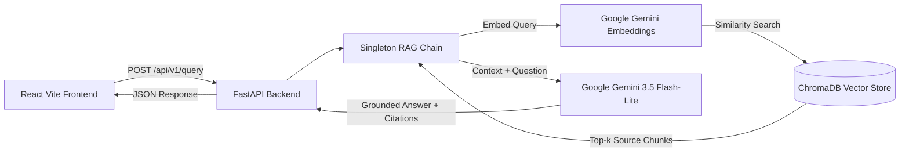

# Short-Intense-Movements RAG Assistant

> A high-performance, domain-specific Retrieval-Augmented Generation (RAG) backend and REST API built with **FastAPI**, **LangChain**, **Google Gemini**, and **ChromaDB**.

[](https://www.python.org/)
[](https://fastapi.tiangolo.com/)
[](https://www.langchain.com/)
[](https://ai.google.dev/)
[](https://www.trychroma.com/)

[](https://vitejs.dev/)

---

## Overview

Organizations and researchers often struggle to extract accurate, fact-grounded insights from dense scientific literature. Generic LLMs without grounding frequently hallucinate or miss domain specifics.

This project implements an end-to-end RAG system specialized in **exercise physiology and high-intensity interval health research** (e.g., studies from *Cell Reports Medicine* and *Nature Medicine*). It indexes scientific text into a Chroma vector store using Google Gemini embeddings and answers queries through a constrained Gemini LLM pipeline, complete with an interactive **React + Vite** frontend.

---

## Key Features

- **Interactive 2-Panel UI:** Side-by-side scientific paper reader and live RAG conversational assistant.
- **Strict Anti-Hallucination Grounding:** Custom prompt design enforcing zero-extrapolation constraints.
- **Source Document Attribution & Citations:** Every response includes the retrieved ChromaDB chunks with source toggles.
- **Pre-warmed Vector Store & Singleton Chain:** Avoids re-embedding on every query by caching the Chroma vector store and LCEL chain on startup.
- **Type-Safe Pydantic Schemas:** Fully validated request/response bodies with interactive OpenAPI/Swagger documentation.
- **FastAPI Backend:** High-performance asynchronous REST endpoints with CORS enabled.

---

## Architecture



---

## Getting Started

### 1. Prerequisites
- Python 3.10+
- Node.js 18+ & npm
- A Google AI Studio API Key ([Get one here](https://aistudio.google.com/))

### 2. Backend Setup & Run

1. **Clone the repository:**
   ```bash
   git clone https://github.com/Chengetanaim/short-intense-movements-rag.git
   cd short-intense-movements-rag
   ```

2. **Create and activate a virtual environment:**
   ```bash
   python -m venv venv
   # Windows:
   .\venv\Scripts\activate
   # macOS/Linux:
   source venv/bin/activate
   ```

3. **Install Python dependencies:**
   ```bash
   pip install -r requirements.txt
   ```

4. **Set up environment variables:**
   Create a `.env` file in the root directory:
   ```env
   GEMINI_API_KEY="your-gemini-api-key-here"
   ```

5. **Start the FastAPI Backend:**
   ```bash
   uvicorn main:app --reload
   ```
   Backend will run at `http://127.0.0.1:8000`.

### 3. Frontend Setup & Run

In a separate terminal window:
```bash
cd frontend
npm install
npm run dev
```
Frontend will run at `http://localhost:5173`.

---

## API Usage & Examples

### Interactive Documentation
FastAPI automatically provides interactive Swagger docs:
- **Swagger UI:** `http://127.0.0.1:8000/docs`
- **ReDoc:** `http://127.0.0.1:8000/redoc`

### Example Request (`POST /api/v1/query`)
```bash
curl -X POST "http://127.0.0.1:8000/api/v1/query" \
     -H "Content-Type: application/json" \
     -d '{"query": "What did the Cell Reports Medicine study find about plasma proteins?"}'
```

---

## Project Structure

```text
├── app/
│   ├── domain.py      # LangChain RAG pipeline, Chroma vector store & singleton chain
│   ├── routes.py      # FastAPI route definitions (POST /api/v1/query)
│   ├── schemas.py     # Pydantic request and response models
│   └── utils.py       # Knowledge base documents and formatting helpers
├── frontend/          # React + Vite application
│   ├── src/
│   │   ├── App.jsx    # 2-panel reader and chat assistant
│   │   ├── index.css  # Dark modern glassmorphic theme
│   │   └── main.jsx
│   └── package.json
├── main.py            # FastAPI entrypoint with CORS & lifespan pre-warming
├── .env.example       # Example environment variables
├── requirements.txt   # Python backend dependencies
└── README.md          # Project documentation
```

---

## License
Distributed under the MIT License.

