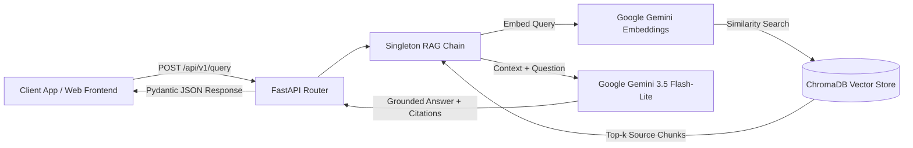

# Short-Intense-Movements RAG API 🏃‍♂️⚡

> A high-performance, domain-specific Retrieval-Augmented Generation (RAG) REST API built with **FastAPI**, **LangChain LCEL**, **Google Gemini**, and **ChromaDB**.

[](https://www.python.org/)
[](https://fastapi.tiangolo.com/)
[](https://www.langchain.com/)
[](https://ai.google.dev/)
[](https://www.trychroma.com/)

---

## Overview

This backend powers an end-to-end RAG system specialized in **exercise physiology and longevity research** (*Cell Reports Medicine* & *Nature Medicine*). It indexes scientific literature into a Chroma vector store using Google Gemini embeddings and answers queries through a strictly constrained Gemini LLM pipeline with source document attribution.

---

## Key Features

- **Strict Anti-Hallucination Grounding:** Zero-extrapolation prompt constraints ensuring answers rely 100% on retrieved literature.
- **Source Document Attribution:** Every query returns the exact ChromaDB chunks and citations used in synthesis.
- **Pre-warmed Vector Store & Singleton Chain:** Avoids re-embedding on every query via cached singleton lifecycle initialization.
- **Type-Safe Pydantic Schemas:** Validated request/response contracts with interactive Swagger / OpenAPI docs.
- **CORS Enabled:** Seamless connection with external web clients (React/Vite).

---

## 🏗️ Architecture



---

## 🚀 Getting Started

### 1. Prerequisites
- Python 3.10+
- A Google AI Studio API Key ([Get one here](https://aistudio.google.com/))

### 2. Installation & Setup

Clone the repository:
```bash
git clone https://github.com/Chengetanaim/short-intense-movements-api.git
cd short-intense-movements-api
```

Create and activate a virtual environment:
```bash
python -m venv venv
# Windows:
.\venv\Scripts\activate
# macOS/Linux:
source venv/bin/activate
```

Install dependencies:
```bash
pip install -r requirements.txt
```

Configure Environment Variables: Create a `.env` file in the root directory:
```env
GEMINI_API_KEY="your-gemini-api-key-here"
```

### 3. Run the Development Server

```bash
uvicorn main:app --reload
```

API will be live at `http://127.0.0.1:8000`.

---

## 📡 API Endpoints & Usage

### Interactive Docs
- **Swagger UI:** `http://127.0.0.1:8000/docs`
- **ReDoc:** `http://127.0.0.1:8000/redoc`

### Query Endpoint (`POST /api/v1/query`)

**Request:**
```bash
curl -X POST "http://127.0.0.1:8000/api/v1/query" \
     -H "Content-Type: application/json" \
     -d '{"query": "What did the Cell Reports Medicine study find about plasma proteins?"}'
```

**Response:**
```json
{
  "query": "What did the Cell Reports Medicine study find about plasma proteins?",
  "answer": "The Cell Reports Medicine study found that among 2,884 plasma proteins measured, the high-intensity group showed increases in 714 proteins related to growth hormones, vascular function, tissue remodeling, and fat metabolism, compared to only 7 proteins in the moderate-intensity group.",
  "sources": [
    {
      "content": "A study recently published in the international journal Cell Reports Medicine explained the reason at the molecular level..."
    }
  ]
}
```

---

## 📂 Project Structure

```text
├── app/
│   ├── domain.py       # LangChain RAG pipeline & Chroma vector store
│   ├── routes.py       # FastAPI route definitions (POST /api/v1/query)
│   ├── schemas.py      # Pydantic request and response models
│   └── utils.py        # Knowledge base documents and formatting helpers
├── main.py             # FastAPI entrypoint with CORS & lifespan pre-warming
├── .env.example        # Example environment variables
├── requirements.txt    # Python backend dependencies
└── README.md           # Backend documentation
```

---

## 📜 License

Distributed under the MIT License.
